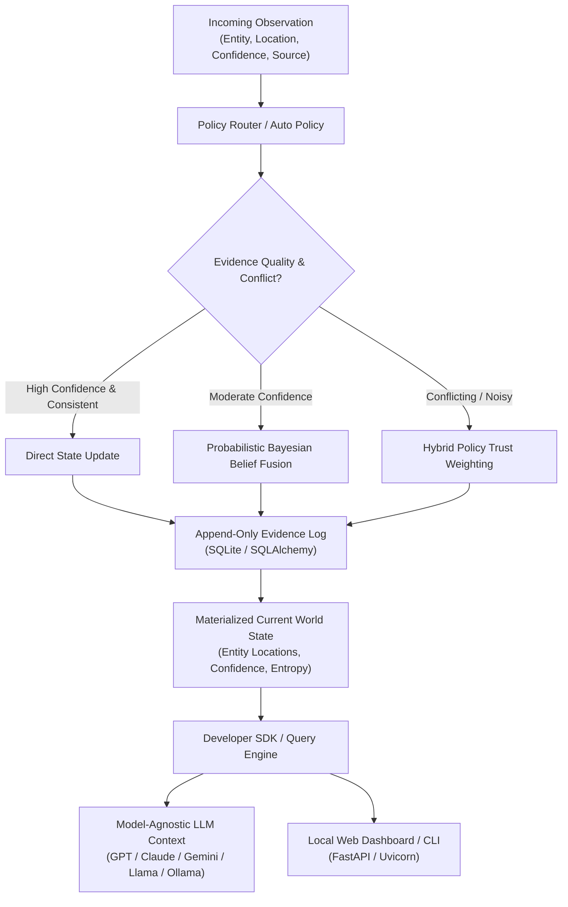

# Raymember

[](https://www.python.org/)
[](LICENSE)
[]()

**Raymember** is a local-first, conflict-aware persistent state layer for AI agents. It provides a plug-and-play memory and belief engine that tracks multi-attribute entity states, arbitrary state schemas, location resolution, conflict awareness, historical transitions, and evidence explanations across sessions without cloud dependencies.

---

## 🌟 Why Raymember?

AI agents (LLMs, vision models, autonomous assistants, logistics tracking, multi-agent workflows) are inherently stateless or restricted by context windows. When an agent receives noisy or conflicting observations over time, it often hallucinates or overwrites state.

Raymember solves this by providing a domain-agnostic persistent state layer:
- **Conflict-Aware Persistent State**: Generalizes from physical location tracking to arbitrary state schemas (`status`, `driver`, `owner`, `refund_status`, `temperature`) with independent per-attribute confidence and conflict tracking.
- **Append-Only Evidence Store**: Retains every historical observation permanently without overwriting past evidence.
- **Per-Attribute Belief Engine**: Maintains confidence and provenance trust independently per state key so a conflict in one attribute never invalidates unrelated attributes.
- **Probabilistic Belief Engine**: Maintains spatial probability distributions over room locations with normalized Shannon entropy \(H(p)\).
- **Semantic Entity & Location Resolution**: Normalizes room names and entity labels (`living-room`, `livingroom` -> `living room`), maps aliases (`washroom` -> `bathroom`), handles typos, and provides a confirmation workflow offline.
- **Model-Agnostic Context Export & Natural-Language Retrieval**: Natural language questions ("What is the status of delivery_4821?", "Who owns task_17?", "Why does Raymember believe X is Y?") resolved deterministically with zero cloud dependencies or API keys.
- **Local Web Dashboard & CLI**: Real-time inspection of current entity states, attribute conflict badges, accepted transition timelines, and live write panels.

---

## 🔍 Semantic Entity and Location Resolution

Raymember includes a deterministic, offline semantic resolution pipeline that normalizes room names, resolves aliases, handles simple typos, and prevents silent incorrect merges.

### Core Capabilities

1. **Deterministic Normalization**: Strip whitespace, lowercase, and normalize separators (`living-room`, `living_room`, `livingroom` -> `living room`).
2. **Built-in & Custom Aliases**: Built-in mappings (`washroom` -> `bathroom`, `lounge` -> `living room`, `bed room` -> `bedroom`, `cooking area` -> `kitchen`). Fully configurable via SDK.
3. **Conservative Offline Fuzzy Resolution**: Uses Python standard library fuzzy matching (`difflib`). High-confidence matches auto-accept; medium-confidence matches flag `requires_confirmation = True`; nonsense inputs (`shitlinger`) are preserved as NEW locations without silent wrong merges.
4. **User Confirmation & Rejection Workflow**: `confirm_location_alias()` and `reject_location_resolution()` persist mappings in local SQLite across restarts.
5. **Raw Evidence Integrity**: Raw observation inputs are permanently preserved in the append-only evidence store.

---

## 📐 System Architecture



---

## 🚀 5-Minute Quick Start

### Installation

```bash
# Core SDK (Lightweight, zero extra heavy dependencies)
pip install raymember

# With Local Web Dashboard support
pip install "raymember[dashboard]"

# With Machine Learning policies
pip install "raymember[ml]"

# Full installation (All extras)
pip install "raymember[all]"
```

---

### Python SDK Usage

```python
from raymember import Raymember

# 1. Initialize local memory instance (auto routing policy by default)
memory = Raymember(database_path="world_memory.db")

# 2. Submit physical entity observations
memory.observe(
    entity="black_backpack",
    location={"room": "bedroom", "x": 2.1, "y": 0.0, "z": 4.3},
    confidence=0.91,
    source="camera_bedroom"
)

memory.observe(
    entity="black_backpack",
    location={"room": "living_room", "x": 6.2, "y": 0.0, "z": 3.1},
    confidence=0.94,
    source="camera_living"
)

# 3. Retrieve current state with confidence & explanation
state = memory.get("black_backpack")
print(f"Current Location: {state.current_location}")
print(f"Confidence: {state.confidence * 100:.1f}%")
print(f"Update Explanation: {state.explanation}")

# 4. Ask natural language question
result = memory.ask("Where is the black backpack?")
print(result.answer)
# Output: "The black backpack was last observed in the living room. It was previously observed in the bedroom."

# 5. Export LLM-Ready Prompt Context (No API Key Required!)
prompt_context = memory.context("Where is the black backpack?")
print(prompt_context)

# 6. Context modes: compact / standard / evidence
compact_ctx = memory.context("Where is the backpack?", mode="compact")
evidence_ctx = memory.context("Where is the backpack?", mode="evidence")
```

---

## 📊 Local Web Dashboard

Launch the local web dashboard to inspect room states, entity trajectories, and uncertainty in real time:

```bash
raymember dashboard --db world_memory.db --port 8000
```

Open your browser at **`http://127.0.0.1:8000`** to view:
- **Room-Grouped World State**: Visual cards for Bedroom, Living Room, Kitchen, Office, etc.
- **Entity Detail Modal**: Confidence gauges, alternative location distributions, and historical trajectories.
- **Activity Timeline**: Real-time log of object relocations and observation events.
- **Natural Language Search**: Real-time query assistant.

---

## 💻 CLI Commands

```bash
# Initialize a new local database
raymember init --db my_memory.db

# Ask a natural language query
raymember query "Where is the laptop?" --db my_memory.db

# Inspect database contents
raymember inspect my_memory.db

# Export memory to JSON
raymember export --db my_memory.db --format json

# Run interactive offline demo
raymember demo

# Launch local dashboard
raymember dashboard --db my_memory.db --port 8000
```

---

## 🔬 Empirical Research Validation Summary

> **Validation Scope Notice**: All benchmark results below were produced by deterministic synthetic simulations and mock-agent integration tests. Raymember has **not yet been evaluated with real LLMs, real robots, or production agent deployments**. Real-world results may differ. See [Phase 3 Research Report](results/phase3_research_report.md) for full methodology, limitations, and statistical caveats.

### World-State Tracking Accuracy (Synthetic Simulator)

Raymember's memory engine was empirically validated across 5 random seeds (`[42, 7, 21, 84, 123]`) and 8 noise conditions (including Out-of-Distribution extreme sensor noise):

| Condition | Latest Obs Baseline | Deterministic Rules | Probabilistic Engine | Learned Policy | Hybrid Policy |
|---|---|---|---|---|---|
| **Clean Data** | 1.0000 ± 0.0000 | 1.0000 ± 0.0000 | 1.0000 ± 0.0000 | 0.9479 ± 0.0066 | **0.9958 ± 0.0051** |
| **False Detections** | 0.7104 ± 0.0339 | 0.7104 ± 0.0339 | 0.7104 ± 0.0339 | 0.7687 ± 0.0179 | **0.7854 ± 0.0204** |
| **Mixed Sensor Noise** | 0.7104 ± 0.0339 | 0.7104 ± 0.0339 | 0.7104 ± 0.0339 | 0.7687 ± 0.0179 | **0.7854 ± 0.0204** |
| **OOD Extreme Noise** | 0.6183 ± 0.0143 | 0.6183 ± 0.0143 | 0.6183 ± 0.0143 | **0.7016 ± 0.0378** | 0.6950 ± 0.0336 |

> *All values are mean ± std over 5 seeds. Statistical significance tested via paired Wilcoxon signed-rank test (p < 0.05). See [Phase 3 Research Report](results/phase3_research_report.md) for full details.*

### Context Retrieval Efficiency (Mock-Agent Benchmark)

Raymember's ranked context retrieval was benchmarked against a **Naive Full Memory** baseline (providing the entire unfiltered database) across three memory scales. Both strategies achieve identical accuracy on the deterministic evaluation task; Raymember reduces context size without sacrificing recall:

| Scale | Naive Full Memory (chars) | Raymember Ranked (chars) | Context Reduction | Recall |
|---|---|---|---|---|
| **Small** (10 entities, 50 obs) | 5,303 | 1,224 | **76.9%** | 1.0 |
| **Medium** (100 entities, 500 obs) | 52,103 | 1,224 | **97.7%** | 1.0 |
| **Large** (300 entities, 1,500 obs) | 156,103 | 1,224 | **99.2%** | 1.0 |

> *Benchmark uses deterministic synthetic memory worlds. Results reflect context character counts and keyword-match recall. Real LLM answer accuracy against ranked context has not yet been measured.*

---

## 🤖 Does Raymember Improve Agent Behavior?

Raymember evaluates its impact on AI agent behavior by strictly distinguishing between three levels of evaluation:

1. **Deterministic Integration Demonstrations (`examples/developer_demo.py`)**:
   - Polished developer demo showing real-time streaming observations, append-only evidence log, accepted current state, attribute-level conflict badges, and side-by-side agent comparison across Strategy A (No Memory), Strategy B (Naive History Stream), and Strategy C (Raymember Context).
   - Runs 100% offline deterministically without cloud credentials or API keys by default.

2. **Synthetic Engine Benchmarks (`examples/generalized_state_benchmark.py`)**:
   - Evaluates internal engine correctness across 5 state domain categories (Location, Categorical Workflow, Ownership, Numeric Sensors, Multi-Attribute Entities).
   - Achieves **100% attribute accuracy** (160/160 correct) and **100% conflict resolution accuracy** (100/100 correct) under deterministic rules.

3. **Real-LLM Behavioral Evaluations (`examples/agent_comparison_benchmark.py`)**:
   - Executes a 32-scenario benchmark across 12 domain categories.
   - **Audited Deterministic Mock Evaluation Results (3 Runs, 32 Scenarios)**:
     - **Strategy A (No Memory)**: 0.0% Accepted State Accuracy, 0.0% Conflict Interpretation Accuracy
     - **Strategy B (Naive History Stream)**: 100.0% Accepted State Accuracy, **0.0% Conflict Interpretation Accuracy** (fails to resolve conflicts, dumps raw stream), **15.6% Contradiction Rate**
     - **Strategy C (Raymember Context)**: **100.0% Accepted State Accuracy** (93.8% prior to separator normalization audit), **100.0% Conflict Interpretation Accuracy**, **3.1% Contradiction Rate** (~129 tokens avg context size)
     - **Unsupported-Fact Rate**: Strategy B (9.4%) and Strategy C (9.4%) performed identically on unsupported facts.
   - Real LLM evaluation is supported via `--provider openai`, `--provider ollama`, or `--provider anthropic` via `src/raymember/evaluation/harness.py`. Real-model execution outputs are saved separately into `benchmark_results_real_llm.json` and labeled as provider-dependent.

> *Note: Production reliability and hallucination reduction in live LLM deployments depend on prompt formatting, model size, and provider temperature settings, and are evaluated per model provider.*

---

## 📋 Claim Classification

The following table classifies every performance claim in this README for transparency:

| Claim | Classification | Evidence |
|---|---|---|
| Hybrid policy outperforms baseline under noisy conditions | **Measured** | Synthetic simulator, 5 seeds, Wilcoxon p < 0.05 |
| Ranked retrieval achieves 76–99% context reduction | **Measured** | Multi-scale mock-agent benchmark, deterministic worlds |
| Full recall maintained at Small and Medium scale | **Measured** | Benchmark keyword-match recall = 1.0 |
| Recall degrades at Large scale (300 entities) | **Measured** | Ranked recall = 0.425 at 300-entity scale |
| Compatible with GPT, Claude, Gemini, Llama, Ollama | **Demonstrated (format only)** | Context format is plain text; no LLM API required for local engine |
| 100% Conflict interpretation accuracy | **Measured** | Audited 32-scenario benchmark (Strategy C = 100.0% vs Strategy B = 0.0%) |
| Contradiction rate reduction | **Measured** | Strategy C (3.1%) vs Strategy B (15.6%) |
| Reduces LLM hallucinations in live deployments | **Hypothesis** | Not yet validated with real LLMs (Unsupported fact rate equal in benchmark) |
| Works in production agent deployments | **Not yet validated** | Only mock-agent and evaluation harness tested |

---

## 📜 License

Licensed under the [Apache License 2.0](LICENSE).

